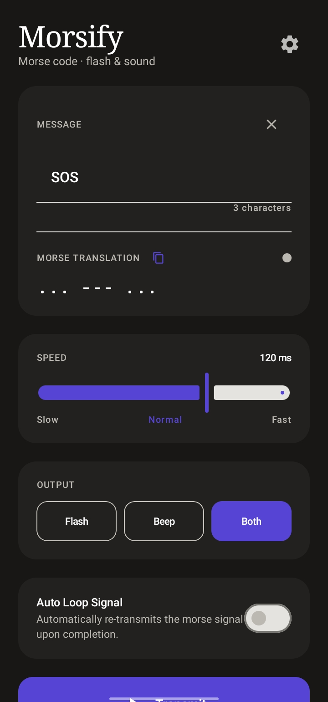

<p align="center">
  
</p>

<h1 align="center">Morsify</h1>
<p align="center">
  <strong>Morse code transmitter for Android with Flashlight &amp; Sound modes</strong>
</p>

<p align="center">
  <a href="https://github.com/Curzyori/morsify/tree/main/version"><strong>📦 Current Version Build</strong></a>
</p>

<div align="center">

[](https://github.com/Curzyori/morsify/stargazers)
[](https://github.com/Curzyori/morsify/network/members)
[](LICENSE)
[](#)

</div>

<p align="center">
  <a href="#why-morsify">Why This</a> ·
  <a href="#key-features">Features</a> ·
  <a href="#installation">Installation</a> ·
  <a href="#preview">Preview</a>
</p>

---

## <a id="why-morsify"></a>🕒 Why Morsify?

Morsify is a clean, lightweight Morse code transmitter app for Android. It translates your text input into precise visual signals using the camera flash, auditory beeps, or both, making it perfect for educational purposes, amateur radio practices, or portable emergency signaling.

|                               |                                                              |
| ----------------------------- | ------------------------------------------------------------ |
| ⚡ **Multi-channel**          | Transmit Morse signals via camera flash, sound beep, or both. |
| 🔊 **Low-Latency**            | Powered by SoundPool engine for clean dit/dat sound playback. |
| 🔄 **Auto Loop**              | Automatically repeat signals to broadcast continuous messages.|
| 🌏 **Multi-Language**         | Supports English and Bahasa Indonesia out of the box.        |

---

## <a id="key-features"></a>🎯 Key Features

| Feature | Status | Description |
| :--- | :---: | :--- |
| **Real-time Encode** | ✅ | Instantly converts typed text to Morse code representation. |
| **Live Highlight** | ✅ | Highlight active character & symbol sequence during transmission. |
| **Auto Loop Mode** | ✅ | Automatically loops transmission after completion. |
| **Speed Control** | ✅ | Fine-tune speed timing from 60ms (fast) up to 240ms (slow). |
| **Language Toggle** | ✅ | Easily toggle between English and Bahasa Indonesia interfaces. |
| **Dynamic Donate Config**| ✅ | Loads donation addresses dynamically from local and remote JSON. |

---

## 🛠 Tech Stack

- **Platform:** Android
- **Language:** Kotlin
- **UI Framework:** Jetpack Compose with Material Design 3
- **Min SDK:** 26 (Android 8.0)
- **Target SDK:** 35 (Android 15)
- **Architecture:** Single-Activity, Compose-Only ViewModel State
- **License:** Apache 2.0

---

## <a id="installation"></a>📦 Installation

Download the latest APK from the [version folder](https://github.com/Curzyori/morsify/tree/main/version):

| Version | File |
| :--- | :--- |
| v1.0.0 | `Morsify-V1.0.0.apk` |

### Build from Source
```bash
git clone https://github.com/Curzyori/morsify.git
cd morsify
./gradlew assembleDebug
```

Output: `app/build/outputs/apk/debug/app-debug.apk`

---

## <a id="preview"></a>🖼️ Preview

<p align="center">
  
</p>

---

## ☕ Buy Me A Coffee

If you find Morsify helpful, consider supporting its development! You can donate using various cryptocurrency addresses.

<p align="center">
  <a href="https://raw.githubusercontent.com/Curzyori/morsify/main/config/donate.json">
    
  </a>
</p>

Crypto payment details (EVM and BTC addresses) are maintained dynamically inside our [donation configuration JSON](https://raw.githubusercontent.com/Curzyori/morsify/main/config/donate.json).

---

## 📄 License

This project is released under the **Apache License 2.0** — see [LICENSE](LICENSE) for full text.

<sub>Built with passion as the 17th Project of the 50 Projects Challenge by **@Curzyori**</sub>
